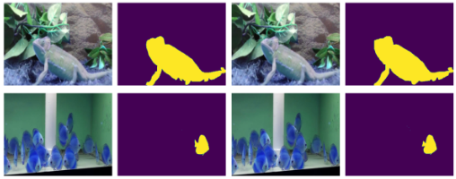
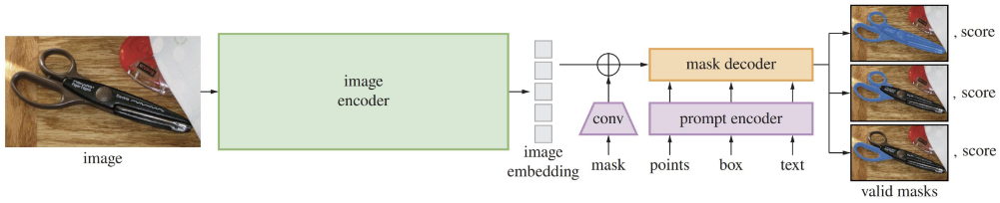
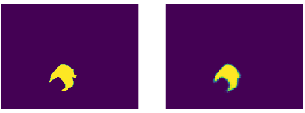
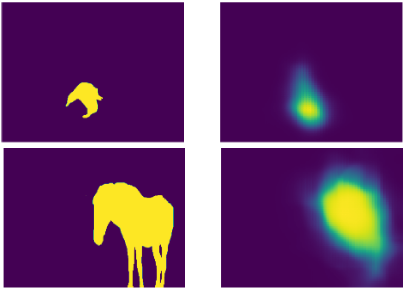

# Extending the Segmentation Model SAM for Tracking

## Introduction
In this project, we extend the newly published segmentation model SAM (Segment Anything Model) to work for tracking by segmentation. In the following sections, the original SAM model is explained along its architecture and the modifications made to extend the model for tracking.

## Data
Before talking about the models and techniques used in this project, first we need to talk about the data itself. To train such model for object tracking we need a huge dataset containing a variation of different sequences of segmented objects. Because of this, the YouTubeVOS dataset is used.
However, because there are multiple instances within the sequences, only the instance with the maximum frequency of pixels was used, as we are building a tracker for tracking only a single object. Thus, we built a training and testing set composed of:

* Image: Image from time T
* Image Mask: The segmentation mask for image T
* Template: Image from time T-1
* Template Mask: The segmentation mask for image T-1

We can see two examples of this in the figure below, ordered as image, image mask, template and template mask.

The first example shows only a single object to track, and its corresponding segmentation mask, while the second one shows a single object selected from a group of other similar objects. We can further try to make the datasets more diverse by taking random instances, however, for now we are just choosing instances based on the maximum frequency of pixels, meaning we choose the biggest instance from many other in each image.

## SAM Architecture

The SAM architecture is composed of three main parts:
* Image encoder
* Prompt encoder
* Mask decoder

### Image encoder
The image encoder is a masked auto-encoder (MAE), pretrained Vision Transformer (ViT) that generates one-time image embeddings

### Prompt encoder
The prompt encoder encodes background points, masks, bounding boxes, or texts into an embedding vector. It consists of two sets of prompts: sparse and dense. Sparse prompts (points, boxes, texts) are represented by positional encodings and added with learned embeddings for each prompt type. Free-form text prompts are represented with an off-the-shelf text encoder from CLIP. Dense prompts (masks) are em- bedded with convolutions and summed element-wise with the image embedding

### Mask decoder
The mask decoder predicts the segmentation masks based on the embeddings from both the image and prompt encoders. It maps the image embedding, prompt embeddings, and an output token to a mask. All of the embeddings are updated by the decoder block, which uses prompt self-attention and cross-attention in two directions (from prompt to image embedding and back).

To sum up, given an input image, the image is first processed by the image encoder, which produces embeddings. Furthermore, a sparse or dense prompt can be provided to the prompt encoder which along the image embeddings form the input to the mask decoder. The mask decoder then uses the embeddings and by using self-attention and cross-attention in two direction, produces and output mask. We can see an example of this process in the figure below.

## SAM for tracking
To extend the model to work for tracking, we first need to consider what is actually needed in basic tracking algorithms. First we need a template, which we use to compare a frame and localize the object being tracked. For this, we can use the image encoder, producing image and template embeddings. 

Next, we need to somehow correlate the information between the two embeddings. One way to do this is to use attention. We use the image embeddings as queries (Q), and the template embeddings as keys (K). For the values (V) however, we use the output of a 1x1 convolution between the template masks and inverse template masks, and add the keys (K) alongside the output. They are further reshaped to (b, c, hw), where b is batch, c is channels and hw is the multiplied height and width dimensions. Thus, for the attention we use a learnable attention (MultiHeadAttention from torch, added to the decoders parameters) and the following values: 

* Queries: Q (image embeddings)
* Keys: K (template embeddings)
* Values: K + V (template embeddings + output of 1x1 template mask convolution)

Next, we have the prompt encoder, which produces sparse and dense embeddings. However, we will not be needing this anymore, thus we omit it from our model. For the dense embeddings, we use the output of the explained attention above, and for the sparse embeddings, we use a learnable token, which is added to the decoder before the training.

Now, we have everything set up, and using the provided information, we feed the image embeddings, sparse and dense embeddings to the mask decoder and get low resolution masks. The masks are then passed through a sigmoid function (converting to positive values) and postprocessed by using bilinear interpolation, returning high resolution segmentation masks.

## Training and results
In order to use the described model, we use the SAM image encoder from the default checkpoint, and only fine-tune the mask decoder. Before the training is started, the learnable token (torch Embeddings), attention function (torch MultiHeadAttention) and 1x1 convolution (torch Conv2d) are added to the decoder and learned along the fine-tuning process.

For the loss, Cross Entrophy Loss is used, and Adam optimizer with 1e-4 learning rate. Because of time constraints, the training was incomplete, and there was only time to test if the extended implementation of SAM for tracking actually worked. For this, we first tried overfitting the model on a single instance and tried to see if it actually learns anything. As expected, after approximately 100 epochs, the model produced a well segmented mask, comparable to the ground truth. We can see an an example of this in the figure below, where the left image is the ground truth and the right image is the produced output.

Furthermore, with the remaining time, we fine-tuned the model on very few itterations (10000 instances and 10 epochs). The results were as expected, the masks were not very good. Although it does manage to localize the greater proportion of the object, but without high quality segmentation.

## Conclusion
In this project, a segmentation model SAM is extended to work for tracking with segmentation masks. The encoder prompt is removed and replaced by an attention mechanism, capturing the correlation between template and frame. The implemented model does learn to segment objects in new frames, however, because of time constraints, the training is cut short and only a mediocre and incomplete model is produced. With further training, and parameter tweaking, the model could produce high resolution segmentation mask while tracking an object throughout sequences of images. However, as the majority of the time allocated for this project was mostly filled up by trying to extend the segmentation model using different methods and techniques, there wasn’t much time left to actually train it extensively.

In the near future, the project will be finished by fune-tuning the model on much higher number of itterations and batch sizes, and with a variation of different parameters.