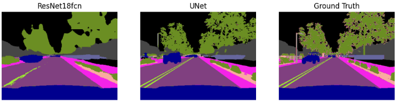
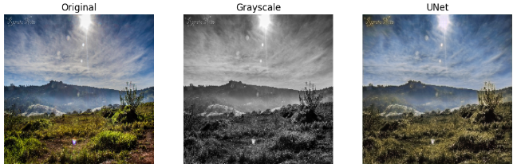
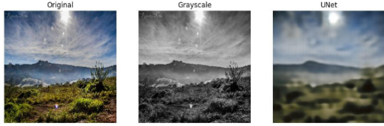
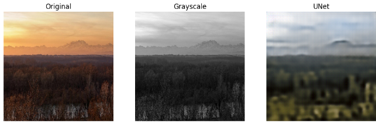

# Semantic Segmentation and Colorization

## Introduction
This assignment is made up of three sub-parts, requiring the implementation of popular CNN models for specific tasks:
* Backbone architecture (ResNet18)
* Semantic segmentation (ResNet18 and UNet)
* Colorization (UNet)

## Backbone architecture
This task requires the implementation of ResNet18 from the original paper, and the goal is to achieve at least 90% accuracy on a provided dataset.
To get good accuracy, fine-tuning is performed, over different parameter values for the model side, and data augmentation for the data side. In the table below, we can see examples of how different parameter values effected the performance of the model.
* LR - Learning rate
* BS - Batch size
* Acc - Accuracy

| Optimizer |  LR    |  BS  | #Epochs | Acc (%) |
|-----------|--------|------|---------|---------|
| Adam      | 1e-3   |  32  |  10     |  87     |
| Adam      | 1e-4   |  32  |  10     |  90     |
| Adam      | 1e-4   |  16  |  10     |  90     |
| **Adam**  |**1e-4**|**16**| **15**  | **92**  |
| Adam      | 1e-4   |  16  |  20     |  91     |
| Adam      | 5e-4   |  16  |  10     |  88     |
| Adam      | 2e-5   |  32  |  10     |  90     |
| Adam      | 2e-4   |  32  |  10     |  89     |
| SGD       | 1e-2   |  32  |  10     |  89     |
| SGD       | 1e-3   |  32  |  10     |  89     |
| SGD       | 1e-3   |  16  |  15     |  90     |
|:--:| 
| *Table 1: Results of fine-tuning ResNet18 with different parameter values and data augmentation techniques.* |

We can see that by using Adam optimizer with a low learning rate of 1e-4, batch size of 16 and 15 number of epochs yielded the best results. Furthermore, by performing data augmentation, on the training and validation data sets, the model performed worse every time. Several augmentation techniques were used such as: slight random rotation, Gaussian blurring, slight stretching. Because of the worse per formance, data augmentation is omitted from table 1. Also,when using SGD optimizer, because of the exploding gradients, the data was normalized prior to training.

## Semantic segmentation

This task requires the expansion of ResNet18 to be used for semantic segmentation by replacing the last fully connected layer to an up-sampling layer (Transpose convolution), and implementation of UNet for semantic segmentation and comparison between the two networks.

Both networks are trained on a provided dataset for 2 epochs, Adam optimizer with 1e-4 learning rate, and their performance is measured by the average IoU (Intersection over Union) score. The average IoU for UNet was **0.5127** and for ResNet18 **0.4570**, as expected UNet outperformed ResNet18. Furthermore, another way to evaluate their performance is to use weighted IoU, weighting each class by its quantity of pixels over the entire image, for which UNet yielded 0.8981 and ResNet18 0.8693. From this we can see that by using weighted, we get a lot higher score. That is because most of the background and big objects are well segmented, contributing a lot to the final score, while the small detailed objects contribute less.

|:--:| 
[ *Figure 1: Example of semantic segmentation results from both networks.* ]

In figure 1, we can see that UNet captured more detail (for example the trees in the background and street lights) from the image and overall did better at segmentation thenResNet18. The average IoU score from the example above for ResNet18 is 0.5060 and for UNet is 0.6072. 
UNet is a type of encoder-decoder network, which retains the spatial information through skip connections, while, ResNet18 is a type of residual network, that retains spatial information through residual connections. They differ in a sense that UNet retains spatial information at multiple scales, making it more efficient for semantic segmentation.

## Colorization
This task requires the modification of UNet by removing the skip connections, and transform the network to a simple encoder-decoder network for image colorization. The skip connections connect the encoder and decoder parts of the corresponding layers, which help to preserve the spatial information and improve overall performance of the network. The network is trained on 5 epochs, with Adam optimizer and 1e-4 learning rate.

|:--:| 
[ *Figure 2: Image colorization example using UNet with skip connections.* ]

In figure 2, we can see an example of well colored image produced by UNet containing skip connections. It produces a high quality colored image, while if we remove the skip connection, the quality gets worse as can be seen in figure 3.

|:--:| 
[ *Figure 3: Image colorization example using UNet without skip connections.* ]

Furthermore, in figure 4, we see an example of the network producing a colored image completely different from the original in terms of color. Though different, the network colored the trees green and the sky blue with white clouds, which makes sense as the majority of the images containing said elements are colored that way.

|:--:| 
[ *Figure 4: Image colorization example using UNet without skip connections, with bad performance.* ]

## Conclusion
This assignment covers several task in the field of computer vision, such as implementing a convolutional neural net- work (CNN) for image classification, semantic segmentation and image colorization. Two models were implemented, expanded and tweaked for various tasks: ResNet18 and UNet.
For the first task, ResNet18 achieved highest classification accuracy of 92% using Adam optimizer with 1e-4 learning rate, batch size of 16 and 15 number of epochs. For the second task, ResNet18 and UNet were compared for semantic segmentation, of which UNet outperformed ResNet18 with average IOU of 0.5127. Finally, for the last task, the image colorization, the implemented UNet was compared to UNet without skip layers, where the latter loses the spatial information and produces a blurred colored image.

