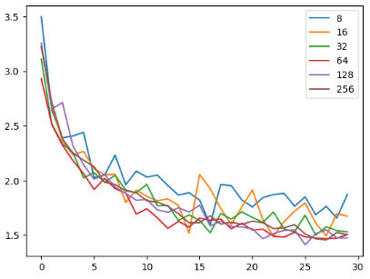
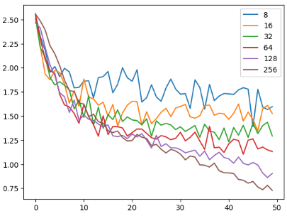

# Text generation

## Introduction
This assignment is made up of 2 sub-parts, where for the first sub-part, LSTM recurrent neural network architecture is implemented and trained on the task of character-level text generation. And for the second sub-part, a Transformer-like network is implemented, again trained on the task of character- level text generation. Furthermore, the two networks are compared with each other using different sequence lengths. Finally, the following question is discussed in more detail:
• What is the point of the masking operation in the Scaled dot-product attention module in the Attention is all you need paper in Figure 1? Why is the attention map masked?

## LSTM
This sub-part requires the implementation of LSTM recurrent neural network from the original paper. As we know, networks do no produce a single character, but rather estimate the likelihood for each possible character. Thus, sampling characters from the network output can be done in different ways where for this task, the Greedy sampling process and Top-K sampling are used.
First, we see the results of training LSTM using the predefined default settings, where sequence length is 128, for 30 epochs.

````
Top-K sampling
-----------------
O Romeo, wherefore art thou should thee.
PAULINA:
Ay: bey that I all them of stard
To hear not with thou a tanding.
First Sonce
Musters:
Ithis it, as I see the must the patters on.
First Suidat:
What set they was not say with thee thy stay
That them fool thysest here are most be again
To have, with her, woss the more to ma
Greedy sampling
----------------
O Romeo, wherefore art thou art the state
That the state the man and the state the state
That the state the man and the state the state
That the state the man and the state the state
That the state the man and the state the state
That the state the man and the state the state
That the state the man and the state the state
Tha
````

We can see that as expected, using the Greedy sampling, the model takes the token with the highest prediction score as the next token, repeating words. While Tok-k sampling, alleviates the problem of generative models repeating text by introducing randomness, we can see that it sometimes generates incorrect text by sampling inappropriate tokens. We can see that even though there are mistakes and misspellings, the model learned how to correctly put white spaces and more times then not, it generates solid text. In figure 1, we can see the losses throughout training, getting the best performance when using a sequence length of 128.

||
|:--:| 
|*Figure 1: Losses throughout training with sequence length of 128, for 30 epochs.*|

In table 1, we can see the results (minimal losses) of training LSTM under different sequence lengths.

| Sequence length | Loss |
|:---------------:|------|
| 8               | 1.596|
| 16              | 1.487|
| 32              | 1.499|
| 64              | 1.467|
| 128             | 1.411|
| 256             | 1.455|

*Table 1: Results of LSTM trained with different sequence length.*

We can see that when increasing sequence length too much, the model performed worse, as in the case of 256 sequence length. This is because the LSTM’s memory cell can ”forget” information from earlier in the sequence as it processes later tokens, which can limit its ability to capture long-term dependencies.

## Transformer-like network
This sub-part requires the implementation of a Transformer-like network according to the original transformer paper.
Again, first an example is shown of the network trained with default setting, of 128 sequence length for 50 epochs.

````
Top-K sampling
----------------------------------------
Here’s to my love! O true apothecary! Thy drugs are quick.
Will maim becomes from your breeding; now, greeting one.
Clown:
That should rescue is grief? they sad chequer her thoughts,
As does are freee play’d to stay always, for schieff.
ELLBOWARD:
Then thus for han the house of York hateful.
We neeed no offer, nor strew me on thee.
That I mock thou chequer he must not
To make me that thing the world of thy compaxesly,
The sea feear in the dangerous of
Greedy sampling
----------------------------------------
Here’s to my love! O true apothecary! Thy drugs are quick.
LADY CAPULET:
Thou hast sworn my life be songs and deathsoldies deaths
To limit the finger than the seat of heaven,
That thou shalt never be mercome to thee
That thou didst come to theee theer and there.
Lord Marshal:
The time that did bear the reverent night.
The senteen years doth conscience and the sea,
That the street of her breeeding steel,
The street and fier our service of his foe,
And t
````

It is clear to see that here, the Greedy sampling does not repeat text like in the LSTM example. Since the LSTM only considers the previous hidden state and the current input to generate the output, it can sometimes get stuck in a loop where it repeatedly generates the same character or sequence of characters. On the other hand, the Transformer architecture uses self-attention to process sequential data, which allows it to capture dependencies between distant time steps more easily than LSTM. In addition, the Transformer does not have a recurrent structure, which means that it does not suffer from the same problem of getting stuck in a loop as the LSTM. We can see that the text generated by Greedy sampling tends to be more repetitive and less diverse, as the same words or phrases are sometimes repeated in the generated text.

| Sequence length | Loss |
|:---------------:|------|
| 8               | 1.390|
| 16              | 1.345|
| 32              | 1.232|
| 64              | 1.102|
| 128             | 0.862|
| 256             | 0.728|

*Table 2: Results of training Transformer-like network with different sequence lengths.*

In table 2, we can see the results of training the Transformer-like network under different sequence lengths.

||
|:--:|
|Figure 2: Losses throughout training with sequence length of 128, for 50 epochs.|

In figure 2, we can see the losses throughout training, getting the best performance when using a sequence length of 256. We can see that the loss decreases as the sequence length increases. We can see that by increasing sequence length, can help the model capture longer-term dependencies in the input sequence. However, it come with trade-offs. One possible trade-off is that the training process becomes slower and more memory-intensive.


## What is the point of the masking operation in the Scaled dot-product attention module in the Attention is all you need paper in Figure 1? Why is the attention map masked?

The masking operation is important in natural language processing tasks, such as language modeling or machine translation, where the input sequence can be very long and the model needs to selectively attend only to the relevant positions in the sequence.
The masking operation works by setting the attention scores for the masked positions to a large negative value before applying the softmax activation function. This effectively removes the masked positions from consideration during the subsequent steps of the attention computation. Without masking, the model could attend to irrelevant positions in the sequence, which could lead to noise and poorer model performance. Therefore, the masking operation is a crucial part of the attention mechanism in the Transformer model and helps ensure that the model only attends to the relevant positions in the input sequence.

## Conclusion
This assignment covers the implementation of LSTM and Transformer-like network for character-level text generation.
Both models are trained using different sequence lengths, of which the Transformer-like network outperforms LSTM with a minimal loss of 0.728 when using a sequence length of 256 for 50 epochs. Output results are shown of both models, and also their performance throughout training. Finally, the masking operation in the Scaled dot-product attention module is explained, and its importance in the Transformer model.


